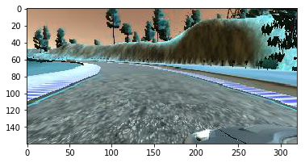
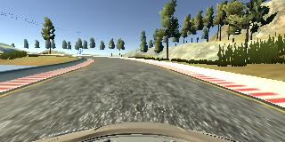
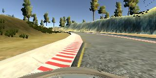

## Behavioral Cloning

In this project, you will use what you've learned about deep neural networks and convolutional neural networks to clone driving behavior. You will train, validate and test a model using Keras. The model will output a steering angle to an autonomous vehicle.

---

**1. Project files**

### My project includes the following files:
* [model.py] containing the script to create and train the model, it uses a Python generator, if needed, to generate data for training rather than storing the training data in memory
* [drive-resize.py] for driving the car in autonomous mode, resized for nvidia model
* [model-bridge.h5] containing a trained convolution neural network, which is the input file to simulator 
* [REAMDE.md] summarizing the results
* [P3.ipynb] my notebook
* [suc1.mp4] recoding the simulated behaviors of my autonomous car 
[suc1.mp4](https://youtu.be/ny0E7QvxdHE)

[PC recorded version](https://youtu.be/CGskYuraCDI)

**2. Project Outline**

### The goals / steps of this project are the following:
* Use the simulator to collect data of good driving behavior
* Build, a convolution neural network in Keras that predicts steering angles from images
* Train and validate the model with a training and validation set
* Test that the model successfully drives around track one without leaving the road
* Summarize the results with a written report

[//]: # (Image References)

[image1]: ./examples/placeholder.png "Model Visualization"
[image2]: ./examples/placeholder.png "Grayscaling"
[image3]: ./examples/placeholder_small.png "Recovery Image"
[image4]: ./examples/placeholder_small.png "Recovery Image"
[image5]: ./examples/placeholder_small.png "Recovery Image"
[image6]: ./examples/placeholder_small.png "Normal Image"
[image7]: ./examples/placeholder_small.png "Flipped Image"

### Dependencies
This lab requires:

* [CarND Term1 Starter Kit](https://github.com/udacity/CarND-Term1-Starter-Kit)

The lab enviroment can be created with CarND Term1 Starter Kit. Click [here](https://github.com/udacity/CarND-Term1-Starter-Kit/blob/master/README.md) for the details.

The following resources can be found in this github repository:
* drive.py
* video.py
* writeup_template.md

The simulator can be downloaded from the classroom. In the classroom, we have also provided sample data that you can optionally use to help train your model.

### Rubric Points
##### Here I will consider the [rubric points](https://review.udacity.com/#!/rubrics/432/view) individually and describe how I addressed each point in my implementation.  

---

### A. Model Architecture and Training Strategy

#### 1. An appropriate model architecture has been employed

My model consists of 5 convolution neural networks with 3x3 or 5x5 filter sizes and depths between 3 and 64; and then 4 fully-connected layers, neurons reduce from 1164 to 10, and output 1 value to compared with label.

The model includes RELU layers to introduce nonlinearity (code notebook cell ), and the data is normalized in the model using a Keras lambda layer (code notebook cell    ). 

#### 2. Attempts to reduce overfitting in the model

The model contains 1 dropout layers in order to reduce overfitting . 

The model was trained and validated on different data sets to ensure that the model was not overfitting. The model was tested by running it through the simulator and ensuring that the vehicle could stay on the track.

#### 3. Model parameter tuning

The model used an adam optimizer, so the learning rate was not tuned manually.

#### 4. Appropriate training data

Training data was chosen to keep the vehicle driving on the road. I used a combination of center lane driving, recovering from the left and right sides of the road, 1 dataset of the curve where car always fails, and 1 dataset of the bridge which has different edges than normal road.

I trained 5 tracks in sequence, after each sequence I will verify with simulator, to see whether new track is needed or not.

For details about how I created the training data, see the next section. 

---

### B. Correction of Model Architecture and Training Strategy

#### 1. Solution Design Approach

The overall strategy for deriving a model architecture was to combine enough convolution layers with dropout and activation layers.

My first step was to use a convolution neural network model similar to the LeNet. I thought this model might be appropriate because it is famous for image predictions. I have successfully used this model to finish traffic sign recognitions.

Then I used Nvidia model, which has 5 convolution layers thus much more powerful.

In order to gauge how well the model was working, I split my image and steering angle data into a training and validation set. 

To combat the overfitting, I modified the model with a 0.5 dropout,  and then reduce training epochs from 5 to 3 in each track training to get rid of overfitting.

The final step was to run the simulator to see how well the car was driving around track one. There were a few spots where the vehicle fell off the track. To improve the driving behavior in these cases, I recorded tracks to train particularly on
the area where the car fails, e.g. I trained with each time I drove the car from left edge back to center, same on the right edge, and later simulation verifies that my car is really good at turning back from edges ! 

At the end of the process, the vehicle is able to drive autonomously around the track without leaving the road.

#### 2. Final Model Architecture

The final model architecture consisted of a convolution neural network with the following layers and layer sizes:

see model from Nvidia:

#### 3. Creation of the Training Set 

To reduce redundant image pixels, I cropped top 60 pixels because no lane is within there;
Then to fit the input size of Nvidia model, I resized cropped images to (66,200,3).

To use as much as data possible, I also used images from left camera and right camera, also cropped and resized,
but remember to +0.2 as corrected label for left camera steer, and -0.2 for right camera.

Also, I flipped all cameras images, thus my dataset can be doubled.

However, the above dataset has one issue, too many zero steer images !  as well as too many +0.2 and -0.2 left and right
images after correction.  So to balance this set, I use a random probability, downsampled 0 steer and its left, right images to be only 10% for training. Here is 1 track of dataset:

I randomly shuffled the data set and put 32 for each batch into batch generator. 

I used this training data for training the model. The 20% validation set helped determine if the model was over or under fitting. The ideal number of epochs was 5 to 3 as evidenced by when overfitting is detected, I need to reduce epochs and bring in new data from new recorded tracks.

I used an adam optimizer so that manually training the learning rate wasn't necessary.

#### 4. Training Process

To capture good driving behavior, I first recorded  1 track using center lane driving. Here is an example image of center lane driving:

I then recorded the vehicle after crossed bridge, and turn from right to left during the 1st sharp turn to left:

To avoid car rushes out of left edge, I carefully recorded the process when it turns back from left edge back to center:

Then I repeated this process on track two in order to get more data points.

---

### C. Discussions

[suc1.mp4](https://youtu.be/ny0E7QvxdHE)

[PC recorded version](https://youtu.be/CGskYuraCDI)

from above video, the car though very good at turn back to center, both from left edge and right edge, however it likes to drive at nearby edge area, instead of strictly stay in center of lane, I guess this is because I drove it crazily, I learned this bad driving way from GTA5, and my car learned it from me, sorry.
To improve this, I need to record new tracks in which I will drive it from parallel to left edge back to straight at center.  
