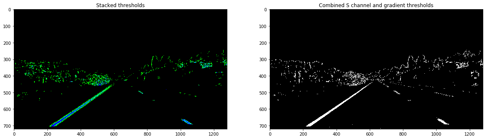

## Advanced Lane Finding

---

**Advanced Lane Finding Project**

### Project Instructions
The goals / steps of this project are the following:

* Compute the camera calibration matrix and distortion coefficients given a set of chessboard images.
* Apply a distortion correction to raw images.
* Use color transforms, gradients, etc., to create a thresholded binary image.
* Apply a perspective transform to rectify binary image ("birds-eye view").
* Detect lane pixels and fit to find the lane boundary.
* Determine the curvature of the lane and vehicle position with respect to center.
* Warp the detected lane boundaries back onto the original image.
* Output visual display of the lane boundaries and numerical estimation of lane curvature and vehicle position.

[//]: # (Image References)

[image1]: ./output_images/origin_calbration10.png "Original"
[image2]: ./output_images/undistort_calibration10.png "Undistorted"
[image3]: ./test_images/xygrad.jpg "Distorted road" 
[image4]: ./output_images/undistorted_xygrad.png "Undistorted road"
[image5]: ./output_images/combined_threshold_binary_xygrad.png "combined threshold binary"
[image6]: ./output_images/combined_s_Xgradient_binary.png  "combined s color and X gradient"
[image7]: ./output_images/undistorted_source_pts.png "undistort image with source points"
[image8]: ./output_images/warped_dest_pts.png  "warped image with destination points"
[image9]: ./output_images/warped_binary.png "warped binary"
[image10]: ./output_images/sliding_window.png "sliding window to filter out peak pts"
[image11]: ./output_images/fit_2nd_poly.png  "Fit a second order polynomial"
[image12]: ./output_images/colorzone.png "draw color zone in undistort original image"

### [Rubric](https://review.udacity.com/#!/rubrics/571/view) Points
#### Here I will consider the rubric points individually and describe how I addressed each point in my implementation.  

---

## Outlines in this document
* Project pipelines are in `advanced-lanes-P4.ipynb`.
* Helper functions are in `helperfunctions.py`.
* The images for camera calibration are stored in the folder called `camera_cal`. 
* The images in `test_images` are for testing your pipeline on single frames.
* The `camera_calibration_result.p` which stores calculated camera matrix and distortion coefficients, is used to undistort following calibration images
* The output video `output_average_pipleline.mp4`

## I. Camera Calibration

#### 1. How to compute the camera matrix and distortion coefficients

The code for this step is contained in the first code cell of the IPython notebook located in "./advanced-lanes-P4.ipynb" `./advanced-lanes-P4.ipynb`

I start by preparing "object points", which will be the (x, y, z) coordinates of the chessboard corners in the world. Here I am assuming the chessboard is fixed on the (x, y) plane at z=0, such that the object points are the same for each calibration image.  Thus, `objp` is just a replicated array of coordinates, and `objpoints` will be appended with a copy of it every time I successfully detect all chessboard corners in a test image.  `imgpoints` will be appended with the (x, y) pixel position of each of the corners in the image plane with each successful chessboard detection.  

I then used the output `objpoints` and `imgpoints` to compute the camera calibration and distortion coefficients using the `cv2.calibrateCamera()` function.  I applied this distortion correction to the test image using the `cv2.undistort()` function and obtained this result: 

## II. Pipeline (single images)

#### 2. Provide an example of a distortion-corrected image.
To demonstrate this step, I will describe how I apply the distortion correction to one of the test images like this one:

form previous chessboard calibration I got mtx and dist for this camera, then I just call cv2.undistort for this new distorted road image, and I will output undistort one.   

Code is in cell 272 , in IPython notebook  `./advanced-lanes-P4.ipynb`

#### 3. Describe how (and identify where in your code) you used color transforms, gradients or other methods to create a thresholded binary image.  Provide an example of a binary image result.
I used a combination of color and gradient thresholds to generate a binary image.  Here's an example of my output for this step.  

Both images are coming from filtering with S color threshold and x gradient threshold, difference is I used mpimg.imread to load in original distorted image for left image, in which blue color indicates s color output, green color indicates x gradient output; and I used cv2.imread to load in original distorted image for right image.

To make left image, Code is in cell 286 , in IPython notebook  `./advanced-lanes-P4.ipynb`
To make right image, Code is in cell 283, xgrad_s_threshold() .

The problem is, both s color threshold and x gradient threshold parameters are defined by trying and test.

#### 4. Describe how (and identify where in your code) you performed a perspective transform and provide an example of a transformed image.

First I need to decide which part is needed to transform into a birds-eye view. I only care about lanes, so I cut out this area and record the source points:

The code for my perspective transform includes a function called `warper()`, which appears in lines 1 through 8 in the file `example.py` (output_images/examples/example.py) The `warper()` function takes as inputs an image (`img`), as well as source (`src`) and destination (`dst`) points.  I chose the hardcode the source and destination points in the following manner:

I hope in transformed birds-eye view, destination points are parallel and indicate a rectangle. so after trying, I set source points and destination points:

This resulted in the following source and destination points:

| Source        | Destination   | 
|:-------------:|:-------------:| 
| 560, 470      | 200, 0        | 
| 730, 470      | 1100, 0       |
| 1080, 720     | 1100, 720     |
| 200, 720      | 200, 720      |

I verified that my perspective transform was working as expected by drawing the `src` and `dst` points onto a test image and its warped counterpart to verify that the lines appear parallel in the warped image.

Notice !!  here source points must be chosen symmetrically, even the mapped lanes may not be parallel in birds-eye view. For all test images which have the same camera calibraion settings,  symmetrical source points can guarantee both lanes can be drawn in birds-eye view, we need make sure right or left lane to be detected first, then second to think they are mapped perfectly parallel.

#### 5. Describe how (and identify where in your code) you identified lane-line pixels and fit their positions with a polynomial?

I first got a perspective transformed binary for easier lanes detection:

![][image9]

Then I used sliding window and draw histogram of detected brighter lane area to identify lane line pixels.

1, Divide the image into 9 horizontal windows of equal height
2, For each step, identify window boundaries in x and y (and right and left), identify the nonzero pixels in x and y within the window, append these indices to the lists. If you found > minpix pixels, recenter next window on their mean position
3, concatenate the arrays of indices, and extract left and right line pixel positions

![][image10]

4. then I used with Polynomial fit and fit my lane lines with a 2nd order polynomial kinda like this:

![][image11]

#### 6. Describe how (and identify where in your code) you calculated the radius of curvature of the lane and the position of the vehicle with respect to center.

I did this in cell 190 in `advanced-lanes-P4.ipynb`

y_eval = np.max(ploty)
left_curverad = ((1 + (2*left_fit[0]*y_eval + left_fit[1])**2)**1.5) / np.absolute(2*left_fit[0])
right_curverad = ((1 + (2*right_fit[0]*y_eval + right_fit[1])**2)**1.5) / np.absolute(2*right_fit[0])

#### 7. Provide an example image of your result plotted back down onto the road such that the lane area is identified clearly.

I implemented this step in my code in `advanced-lanes-P4.ipynb`, after using 2nd polynomial I get (x,y) pairs for left and right lanes, then I draw color between them, then calls warpPerspective to draw the colored zone back to original image.  Here is an example of my result on a test image:

![][image12]

#### 8. Output visual display of the lane boundaries and numerical estimation of lane curvature and vehicle position.

---

## III. Pipeline (video)

#### 1. Provide a link to your final video output.  Your pipeline should perform reasonably well on the entire project video (wobbly lines are ok but no catastrophic failures that would cause the car to drive off the road!).

Here's a [project output color video](https://youtu.be/E7K9GEic8C8)

---

## IV. Discussion

#### 1. Briefly discuss any problems / issues you faced in your implementation of this project.  Where will your pipeline likely fail?  What could you do to make it more robust?
  
1, problem: needs manually try and set for x gradient and s color threshold

2, pproblem: for perspective transform, hard to find exact parallel lane pairs, also need to manualy set for destination and source points from orginial and undistorted images, if choose unsymmetric source points from one undistored image, then 
for rest testing images this is not a good option, because other test images may miss to detect either left or right lane within their birds-eye view !

3, from previous unperfectly parallel lanes I calculated out the radius of left and right lanes, since they are not paralel in birds-eye view, both radius can differ 10 times ! this should exceed accepted range of proper lane radius.

how to improve: here I only use y=720 which is the maximum value in image to calculate radius. Considering lanes are continuous, I think I can choose more y values for calculations and then choose a smooth value.

4, from my generated output video, most time both lanes detected are matching the real lines, however under tree shadowing area, when daylight is suddenly dark, I can see my detect lanes can suddenly jump into wired shapes. My detection system should be more robust under sudden daylight changes !

solution 1): use Markov assumption, to average previous frame and current frame, in case frame changes too much
solution 2): use S color + V color to better detect lanes
