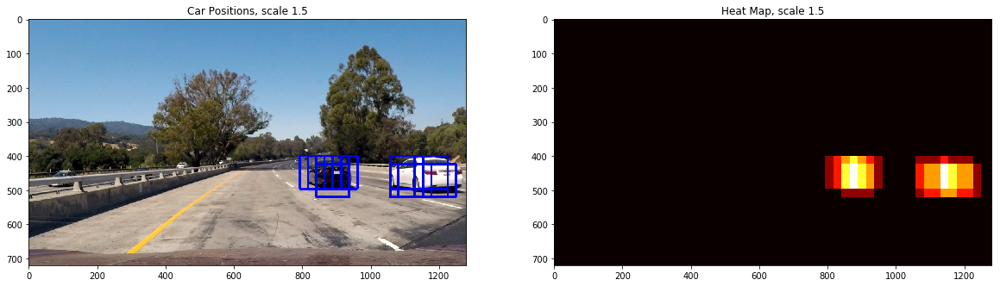

## Vehicle Detection

In this project, your goal is to write a software pipeline to detect vehicles in a video (start with the test_video.mp4 and later implement on full project_video.mp4), but the main output or product we want you to create is a detailed writeup of the project.

---

**1. Project files**

* `P5.ipynb`: Notebook with final model
* `helperfunctions.py`: Helper functions for `P5.ipynb`
* `README.md`: This doc!
* `output_images/`: Contains images used in this doc
* `test_images/`: Contains images to be tested

**2. Project Outline**

The goals / steps of this project are the following:

* Perform a Histogram of Oriented Gradients (HOG) feature extraction on a labeled training set of images and train a classifier Linear SVM classifier
* Optionally, you can also apply a color transform and append binned color features, as well as histograms of color, to your HOG feature vector. 
* Note: for those first two steps don't forget to normalize your features and randomize a selection for training and testing.
* Implement a sliding-window technique and use your trained classifier to search for vehicles in images.
* Run your pipeline on a video stream (start with the test_video.mp4 and later implement on full project_video.mp4) and create a heat map of recurring detections frame by frame to reject outliers and follow detected vehicles.
* Estimate a bounding box for vehicles detected.

[//]: # (Image References)
[image1]: ./output_im_ages/carnocar.png
[image2]: ./output_images/getHogFeatures.png
[image3]: ./examples/sliding_windows.jpg
[image4]: ./examples/sliding_window.jpg
[image5]: ./examples/bboxes_and_heat.png
[image6]: ./examples/labels_map.png
[image7]: ./examples/output_bboxes.png
[video1]: ./project_video.mp4

### [Rubric](https://review.udacity.com/#!/rubrics/513/view) Points
#### Here I will consider the rubric points individually and describe how I addressed each point in my implementation.  

---

## Histogram of Oriented Gradients (HOG)

#### 1. Explain how (and identify where in your code) you extracted HOG features from the training images.

The get_hog_features() for this step is contained in cell 35 of the IPython notebook and helperfunctions.py .

I started by reading in all the `vehicle` and `non-vehicle` images.  Here is an example of 10 of each of the `vehicle` and `non-vehicle` classes:

I then explored different color spaces and different `skimage.hog()` parameters (`orientations`, `pixels_per_cell`, and `cells_per_block`).  I grabbed random images from each of the two classes and displayed them to get a feel for what the `skimage.hog()` output looks like.

Here is an example using the `YCrCb` color space and HOG parameters of `orientations=9`, `pixels_per_cell=(8, 8)` and `cells_per_block=(2, 2)`:

#### 2. Explain how you settled on your final choice of HOG parameters.

I tried various combinations of parameters and based on later test accuracy of trained linearSVC, I can see that:

1), for color features, spatial size = 32,32 and hist_bins = 32 leads to better result;

2), with above chosen color params, combine HOG features to train,

2.a) color space YCrCb is a little better than others
2.b) hist, spatial features play not much effort, with only HOG is only little worse than combine all of them
2.c) all hog channels are better than 1 channel, because more features are brought in
2.d) in HOG parameters, cell per block 8 is worse than 2
2.e) in HOG parameters, pix_per_cell 4  worse than  8 
2.f) in HOG parameters, orient 5 worse than 9
2.g) finally, I don't have all day time to for loop all possibilities, besides this for loop leads to memory error on my AWS instance

the best accuracy: 
total trained with : 14208

17.7143 Seconds to train SVC...
Test Accuracy of SVC =  0.99380631

Parameters:
color_space:  YCrCb
orient:  9
pix_per_cell:  8
cell_per_block:  2
hog_channel:  ALL
spatial_size:  (32, 32)
hist_bins:  32
spatial_feat:  True
hist_feat:  True
hog_feat:  True
Feature vector length:  8460 len(X_train[0])

#### 3. Describe how (and identify where in your code) you trained a classifier using your selected HOG features (and color features if you used them).

I trained a linear SVM using combinations of spatial, hist and hog features:

I take all 3 hog channels, concatenate all features together, and use normalization to uniform the scales ;
I alsoe define a random seed from 0 -100, and split all dataset into Train set and Test set ;

I shuffle train set before each training;

the linearSVC trains faster and better than rbf kernel SVC, also linearSVC runs faster than linear kernel SVC ;

due to memory issue, I carefully selects params to train, instead of run loops.

## Sliding Window Search

#### 1. Describe how (and identify where in your code) you implemented a sliding window search.  How did you decide what scales to search and how much to overlap windows?

instead of scaning list of windows from original lane picture, and treat each window-size image and extract features and use classfier to predict, I jump to enhanced way:  Hog Sub-sampling Window Search

1, The find_cars only has to extract hog features once and
then can be sub-sampled to get all of its overlaying windows;

x start, stop, y start, stop are chosen to cover bottom part

2, instead of overlapping factor, we define anyway 64 as window sampling rate to scan the whole region of interest;

we can extract spatial and hist features on each window-size image, but only once for hog !

3, Its possible to run this same function multiple times 
for different scale values to generate multiple-scaled search windows.

scale = 0.5 leads to too long calucation time and too small windows, 
can't even wrap the whole car!

so use scale 2 and 1.5 and 1 run 3 scans, collect found windows, and finally 
labeled windows and draw once;

#### 2. Show some examples of test images to demonstrate how your pipeline is working.  What did you do to optimize the performance of your classifier?

run 3 scans with each scale, each scale scan return a list of windows, in which trained classfier detections a vehicle, use a deque to store 3 frames for each scale, thus 9 window list totally, if more than 9 window lists, pop out the earlist 3 lists,i.e. the earlist 1 of each scale

---

## Video Implementation

#### 1. Provide a link to your final video output.  Your pipel shineould perform reasonably well on the entire project video (somewhat wobbly or unstable bounding boxes are ok as long as you are identifying the vehicles most of the time with minimal false positives.)

Here's a [link to my video result](https://youtu.be/A51hQnZKQ58)

#### 2. Describe how (and identify where in your code) you implemented some kind of filter for false positives and some method for combining overlapping bounding boxes.

I summerize heatmap from 3 scale scaned results, and choose 4 as threshold to reduce false positive detections, which may come from opposite direction lanes.

I recorded the positions of positive detections in each frame of the video.  From the positive detections I created a heatmap and then thresholded that map to identify vehicle positions.  I then used `scipy.ndimage.measurements.label()` to identify individual blobs in the heatmap.  I then assumed each blob corresponded to a vehicle.  I constructed bounding boxes to cover the area of each blob detected.  

Here's an example result showing the heatmap from a series of frames of video, the result of `scipy.ndimage.measurements.label()` and the bounding boxes then overlaid on the last frame of video:

### Here is the output of `scipy.ndimage.measurements.label()` on the integrated heatmap from all six frames:

---

## Discussion

#### 1. Briefly discuss any problems / issues you faced in your implementation of this project.  Where will your pipeline likely fail?  What could you do to make it more robust?

1, sub-sampling of hog feature is intelligent way to reduce calucation time, otherwise extrace hog features from 100+ windows are time consuming !! 

2, use deque() to store 3 continuous frames can lead to stable and robust behaviour, like in P4 I used previous lane position to decide whether current frame's lane position is reasonable or not

3, every frame I used 3 scales to scan, it seems a little time consuming, maybe a more smarter, dynamic scale shall be calculated on real-time
